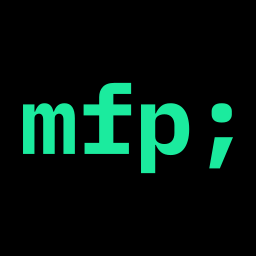

# WIP



## About mfp;

mfp; is a PWA remix of [musicforprogramming.net](https://musicforprogramming.net).

All the episode data comes from the [musicforprogramming.net RSS feed](https://musicforprogramming.net/rss.xml).

Thank you [Dataset](https://datassette.net/) for all the years of amazing music.

This app is not affiliated with [musicforprogramming.net](https://musicforprogramming.net).

Details on how to support [Dataset](https://datassette.net/) and the episode artists can be found here:

[https://musicforprogramming.net/credits](https://musicforprogramming.net/credits)

The PWA can be found here:

https://mfp-app.pages.dev/

## Install

Create Python virtual environment and install Python dependencies

```bash
python -m venv .venv
source .venv/bin/activate
pip install -r requirements.txt
```

## Run mfp; locally

```bash
soruce .venv/bin/activate
npm run dev
```

### Fetch latest musicforprogramming episode and rebuild the index.html and espisodes.json

```bash
npm run workflow-build-mfp
```

### Rebuild PWA assets

```bash
npm run generate-pwa-assets
```

### Note

I strongly suggest using VSCode for editing and managing development environment.
