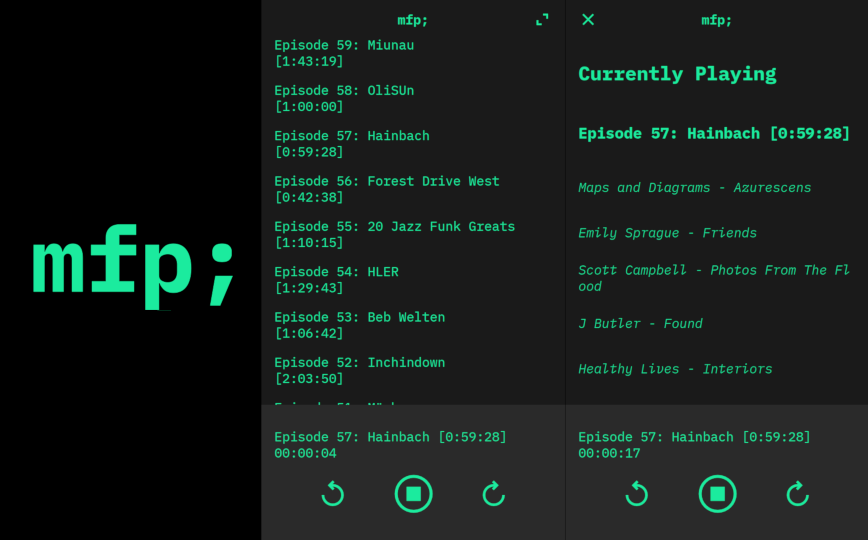

# mfp;



## About

mfp; is a PWA remix of [musicforprogramming.net](https://musicforprogramming.net).

All the episode data comes from the [musicforprogramming.net RSS feed](https://musicforprogramming.net/rss.xml).

Thank you [Datassette](https://datassette.net/) for all the years of amazing music.

Details on how to support [Datassette](https://datassette.net/) and the episode artists can be found here:

[https://musicforprogramming.net/credits](https://musicforprogramming.net/credits)

NOTE: This app is not affiliated with [musicforprogramming.net](https://musicforprogramming.net).

The PWA can be found here:

[https://mfp-app.pages.dev/](https://mfp-app.pages.dev/)

## Install

### Requirements

- Node.js 22.x
- Python 3.13.x

### 1. Create Python virtual environment and install Python dependencies

```bash
cd /path/to/mfp-app-pwa
python -m venv .venv
source .venv/bin/activate
pip install -r requirements.txt
```

### 2. Install Node dependencies

```bash
cd /path/to/mfp-app-pwa
npm install
```

## Run mfp; locally

```bash
soruce .venv/bin/activate
npm run dev
```

## Fetch latest musicforprogramming episodes and rebuild the index.html and espisodes.json

```bash
npm run mfp-fetch-and-build
```

## Rebuild PWA assets

```bash
# build icons
npm run icons
# build iOS splashscreens
npm run splash
```

## Note

I strongly suggest using VSCode for editing and managing the development environment.
